# Materializer WP
<small>A set of Material Design components for WordPress</small>

Materializer WP is a fully-featured set of Material Design components,
packed up in a WordPress plugin, and ready to be used on any website.

The plugin is ‘short-code based’, so you can use all of the features
easily on any post, page, or custom post type. There over 25 different
short-codes and components that take care of all the hard work, and
allow you to turn any blog or website into a Material Design wonderland.

Getting Started
===============

Installation
------------

To install the plugin:

-   Download the \`.zip\` file.
-   In your Wordpress Dashboard, navigate to “Plugins -&gt; Add New”
-   Select “Upload Plugin”, and choose this plugins zip file from
    your computer. Hit “Install Now”.
-   Once installed, simply press “Activate Plugin”, and you’re ready to
    go!

Quick Start
-----------

As a quick example of what’s possible, here is how you would set up a
[Material Design Card](https://www.google.com/design/spec/components/cards.html):

``` {.commonlisp}
  [card title="A Cool Card!" text="text-darken-3 grey" title_color="blue"]
  I am a very simple card. I am good at containing mall bits of
  information. I am convenient because I require little markup to use
  effectively.
  [link text="blue" to="/"]Go Home[/link]
  [/card]
```

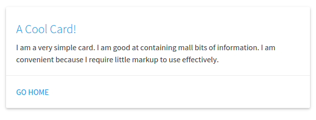

In this example, we have a `[card][/card]` shortcode, with a few
attributes. A title, the text color, and the title color. Inside of the
shortcode we have a couple more things: The card’s text, and action
links (which also have a text color attribute, and a `to` attribute
which links to the home page).

And a Material Design card is as easy as that. Cards are a great way to
have useful information and actions pop out at your visitor, while
keeping a slick design.

Features
========

Shortcodes
----------

There are over 25 different shortcodes and components to choose from.
All of the shortcodes contain “attributes” that allow several different
ways to build one component.

Below is a list of all the currently available components, click on one
to view an example, and see how to customize it.

**Cards**
-   *Basic Card*
-   *Image Card*
-   *Revealing Card*

**Buttons**
-   *Raised Button*
-   *Floating Button*
-   *Fixed Action Button*
-   *Flat Button*
-   *Large Button*

**Collapsibles**
-   [Collapsible](#Collapsible)

**Collections**
-   [Collection](#Collection)
-   *Link Collection*

**Dropdowns**
-   [Dropdown](#Dropdown)

**Images**
-   *Material Box Image*
-   *Responsive Image*
-   *Circular Image*

**Pagination**
-   [Pagination](#Pagination)

**Loading Icons**
-   *Linear Loader*
-   *Fixed Linear Loader*
-   *Circular Loader*
-   *Flashing Circular Loader*

**Tables**
-   *Striped Table*
-   *Hoverable Table*
-   *Centered Table*
-   *Bordered Table*
-   *Responsive Table*

**Viedos**
-   *Responsive Video*
-   *HTML5 Video*

Color Pallette
--------------

There is a built in Material Design Color pallette that be used with
every short-code. You’re not stuck with the default color scheme, so you
can integrate Materializer into your existing website seamlessly.

…more info coming soon!

Shortcode Details
=================

Cards
-----

### Basic Card&lt;&lt;Basic Card&gt;&gt;

Available Attributes:
-   title: The title of the card (optional)
-   title~color~: The color of the title (optional)
-   color: The backgrund color of the card (optional)
-   text: The text color of the card (optional)
-   Links: Nested Action Link short-codes (optional)

Example:

``` {.text}
  [card title="A Cool Card!" text="text-darken-3 grey" title_color="blue"]
  I am a very simple card. I am good at containing mall bits of
  information. I am convenient because I require little markup to use
  effectively.
  [link text="blue" to="/"]Home[/link]
  [/card]
```


A Basic Card can also be refitted to be a more simple Card Panel:

Example:

``` {.text}
[card color="teal" text="white"]
This is a simple panel card, these are really great for just
blocking together small bits of markup on a nice eye-catching
color
[/card]
```

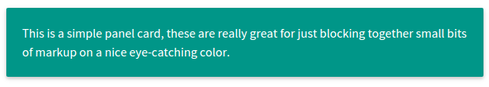

### Image Card&lt;&lt;Image Card&gt;&gt;

Available Attributes:
-   img: The link to an image for display on the card
-   color: The background color of the card (optional)
-   text: The text color of the card (optional)
-   Links: Nested Action Link short-codes (optional)

``` {.text}
  [card_img img="/wordpress-logo.png"]
  I am a very simple image card. I am good at containing images with
  action links.
  [link text="blue" to="/"]Home[/link]
  [/card_img]
```

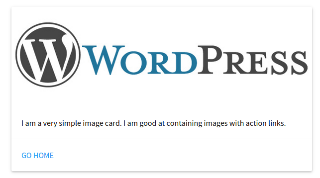

### Revelealing Card&lt;&lt;Revealing Card&gt;&gt;

A Revealing Card is like a Basic Card that can be opened to display more
information.

Available Attributes:
-   title: The title of the card (optional)
-   title~color~: The color of the title (optional)
-   color: The backgrund color of the card (optional)
-   text: The text color of the card (optional)
-   img: The link to an image for display on the card
-   links: Nested Action Link short-codes (optional)

Example:

``` {.text}
[card_revealtitle="A Revealing Card"]
I am a very cool revealing card. I am good at containing content, with
more content inside.
[link text="blue" to="/"]Go Home[/link]
[card_open]And here is some more content inside with some other really cool stuff.[/card_open]
[/card_reveal]
```

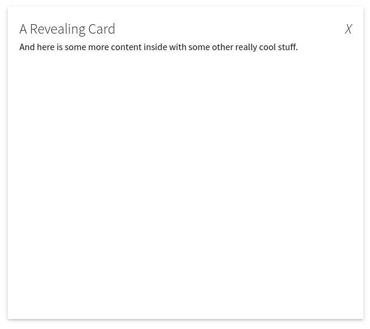
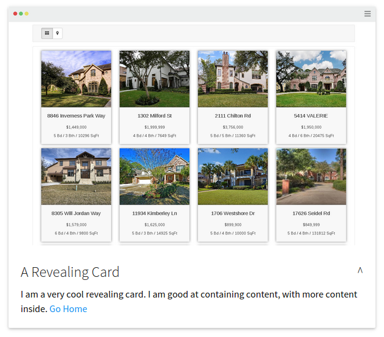

Buttons
-------

### Raised Button&lt;&lt;Raised Button&gt;&gt;

Available Attributes:
-   to: The page to go to when the button is clicked
-   color: The background color of the card (optional)
-   text: The text color of the card (optional)

Example:

``` {.text}
[btn to="/" color="blue" text="white"]Materializer Button[/btn]
```

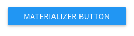

### Floating Button&lt;&lt;Floating Button&gt;&gt;

Available Attributes:
-   to: The page to go to when the button is clicked
-   color: The background color of the card (optional)
-   text: The text color of the card (optional)

Example:

``` {.text}
[btn_floating to="/"  color="red" text="white"]Home[/btn_floating]
```

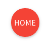

### Fixed Action Button&lt;&lt;Fixed Action Button&gt;&gt;

Available Attributes:
-   color: The background color of the card (optional)
-   text: The text color of the card (optional)
-   action: Nested `[action]` shortcodes, that are the small popups when
    the button is hovered, they take all the attributes, plus the “to”
    attribute which is a link to a page.

Example:

``` {.text}
[btn_fixed_action color="red" text="white"]Home
[action to="/contact-us" color="yellow" text="red"]Hi[/action]
[action to="/" color="blue" text="white"]You[/action]
[/btn_fixed_action]
```

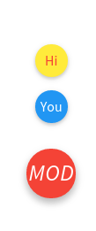

### Flat Button&lt;&lt;Flat Button&gt;&gt;

Available Attributes:
-   to: The page to go to when the button is clicked
-   color: The background color of the card (optional)
-   text: The text color of the card (optional)

Example:

``` {.text}
[btn_flat to="/"]Home[/btn_floating]
```

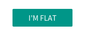

### Large Button&lt;&lt;Large Button&gt;&gt;

Available Attributes:
-   to: The page to go to when the button is clicked
-   color: The background color of the card (optional)
-   text: The text color of the card (optional)

Example:

``` {.text}
[btn_large to="/"]Home[/btn_floating]
```

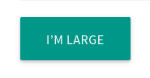

Collapsibles
------------

### Collapsible<span id="Collapsible"></span>

Available Attributes:
-   type: Either popout or nothing.
-   style: Either accordion, expandable, or nothing.
-   color: The backgrund color of the card (optional)
-   text: The text color of the card (optional)
-   collapsible~item~: Nested `[collapsible_item]` shortcodes, that make
    up each item in the component. They take a title, color, and
    text attribute.

Example:

``` {.text}
[collapsible]
[collapsible_item title="Item One"]Some content in here.[/collapsible_item]
[collapsible_item title="Item Two"]Some more content in here.[/collapsible_item]
[collapsible_item title="Item Three"]And some more content in this guy.[/collapsible_item]
[/collapsible]
```

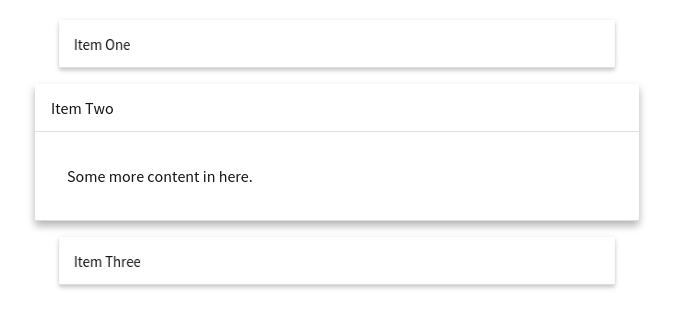

Collections
-----------

### Collection<span id="Collection"></span>

Available Attributes:
-   color: The backgrund color of the card (optional)
-   text: The text color of the card (optional)
-   collection~item~: Nested `[collection_item]` shortcodes, that make
    up each item in the component. They take a color and text
    color attribute.

Example:

``` {.text}
[collection]
[collection_item]Alvin[/collection_item]
[collection_item]and the[/collection_item]
[collection_item]Chipmunks[/collection_item]
[/collection]
```

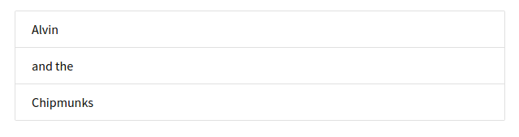

### Link Collection&lt;&lt;Link Collection&gt;&gt;

Available Attributes:
-   type: Needs to be set to type=“links”
-   color: The backgrund color of the card (optional)
-   text: The text color of the card (optional)
-   collection~item~: Nested `[collection_item]` shortcodes, that make
    up each item in the component. They take a color and text color
    attribute - as well as a “to” attribute which is a page link.

Example:

``` {.text}
[collection type="links"]
[collection_item]Alvin[/collection_item]
[collection_item]and the[/collection_item]
[collection_item]Chipmunks[/collection_item]
[/collection]
```

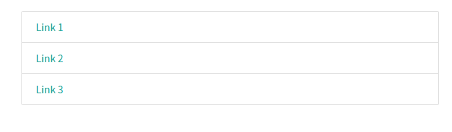

Dropdowns
---------

### Dropdown<span id="Dropdown"></span>

Available Attributes:
-   name: Give the dropdown component a name (required)
-   color: The backgrund color of the card (optional)
-   text: The text color of the card (optional)
-   dropdown~item~: Nested `[dropdown_item]` shortcodes, that make up
    each item in the component. They take a color and text color
    attribute - as well as a “to” attribute which is a page to link to.

Example:

``` {.text}
[[dropdown name="mydrop" text="white"]
Drop Me Down
[dropdown_item to="/"]Home[/dropdown_item]
[dropdown_item to="/services/"]Services[/dropdown_item]
[dropdown_item to="/contact"]Contact Us[/dropdown_item]
[/dropdown]]
```

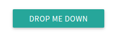
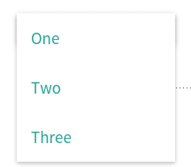

Images
------

### Material Box Image&lt;&lt;Material Box Image&gt;&gt;

The Materializer Image Box displays a normal image, and when it clicked,
it open the image in a fullscreen “lightbox” style display.

Available Attributes:
-   src: The link to the image

Example:

``` {.text}
[img_box src="http://mysite.com/image.jpg"]
```

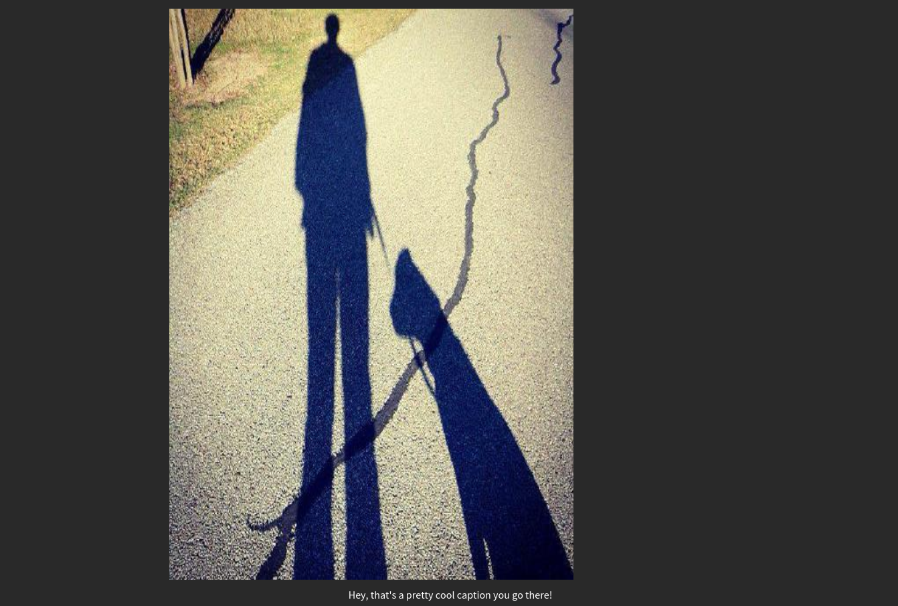

### Responsive Image&lt;&lt;Responsive Image&gt;&gt;

Automatically makes images responsive

Available Attributes:
-   src: The link to the image

Example:

``` {.text}
[img_responsive src="http://mysite.com/image.jpg"]
```

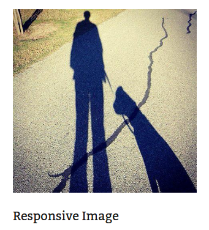

### Circular Image&lt;&lt;Circular Image&gt;&gt;

Makes any image circular

Available Attributes:
-   src: The link to the image

Example:

``` {.text}
[img_circle src="http://mysite.com/image.jpg"]
```


Pagination
----------

### Pagination<span id="Pagination"></span>

Available Attributes:
-   color: The backgrund color of the card (optional)
-   text: The text color of the card (optional)
-   Links: Nested Action Link short-codes (optional)
-   items: \[pag~item~\]’s are what make up the pagination. In addition
    to color and text, These can take a variety of attributes:
    -   disabled: unclickable
    -   active: make this pag~item~ active
    -   to: a link to a page

Example:

``` {.text}
[pagination]
[pag_item disabled]<[/pag_item]
[pag_item to="#!" active]1[/pag_item]
[pag_item to="/page-2"]2[/pag_item]
[pag_item to="/page-3"]3[/pag_item]
[pag_item to="/page-4"]4[/pag_item]
[pag_item to="/page-5"]5[/pag_item]
[pag_item to="/page-6"]6[/pag_item]
[pag_item to="/pages"]>[/pag_item]
[/pagination]
```

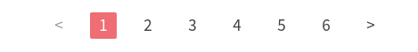

Loading Icons
-------------

### Linear Loader&lt;&lt;Linear Loader&gt;&gt;

Available Attributes:
-   color: The backgrund color of the loader (optional)
-   text: The progress color of the loader (optional)

Example:

``` {.text}
[preloader_linear]
```

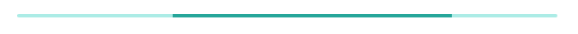

### Fixed Linear Loader&lt;&lt;Fixed Linear Loader&gt;&gt;

Available Attributes:
-   color: The backgrund color of the loader (optional)
-   text: The progress color of the loader (optional)
-   width: The width of the progress bar to fill

Example:

``` {.text}
[preloader_linear width="75%"]
```

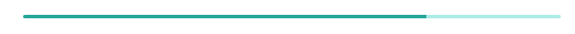

### Circular Loader&lt;&lt;Circular Loader&gt;&gt;

Available Attributes:
-   color: The color of the loader (optional)

Example:

``` {.text}
[preloader_circular]
```

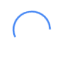

### Flashing Circular Loader&lt;&lt;Flashing Circular Loader&gt;&gt;

Available Attributes:
-   flashing: This needs to be inside the shortcode.

Example:

``` {.text}
[preloader_circular flashing]
```

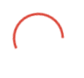

Tables
------

The table shortcodes are a bit different in that they only *wrap*
existing HTML (or shortcodes).

You can use any of the table types (striped, hoverable, centered,
responsive, bordered) together in the same shortcode.

Example:

``` {.text}
[table style="striped"]
<thead>
 <tr>
   <th data-field="name">Item Name</th>
   <th data-field="price">Item Price</th>
 </tr>
</thead>
<tbody>
    <tr>
      <td>Eclair</td>
      <td>$0.87</td>
    </tr>
    <tr>
      <td>Jellybean</td>
      <td>$3.76</td>
    </tr>
    <tr>
      <td>Lollipop</td>
      <td>$7.00</td>
    </tr>
</tbody>
[/table]
```

### Striped Table&lt;&lt;Striped Table&gt;&gt;

Available Attributes:
-   color: The backgrund color of the table (optional)
-   text: The text color of the table (optional)

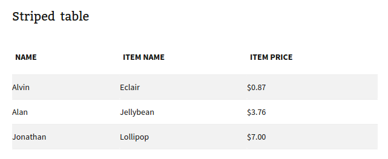

### Hoverable Table&lt;&lt;Hoverable Table&gt;&gt;

Available Attributes:
-   color: The backgrund color of the table (optional)
-   text: The text color of the table (optional)

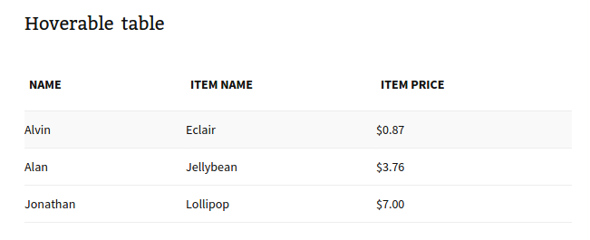

### Centered Table&lt;&lt;Centered Table&gt;&gt;

Available Attributes:
-   color: The backgrund color of the table (optional)
-   text: The text color of the table (optional)

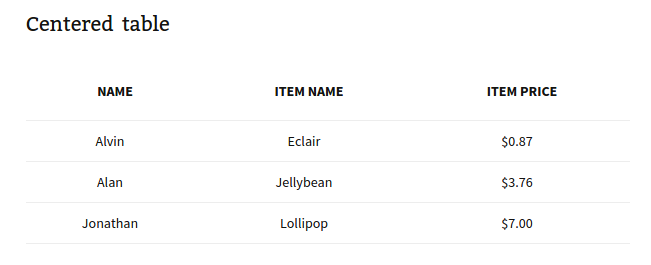

### Bordered Table&lt;&lt;Bordered Table&gt;&gt;

Available Attributes:
-   color: The backgrund color of the table (optional)
-   text: The text color of the table (optional)

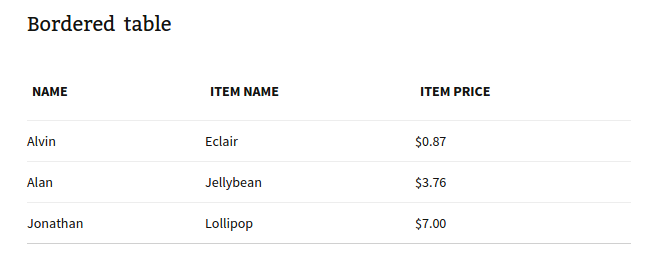

### Responsive Table&lt;&lt;Responsive Table&gt;&gt;

Available Attributes:
-   color: The backgrund color of the table (optional)
-   text: The text color of the table (optional)

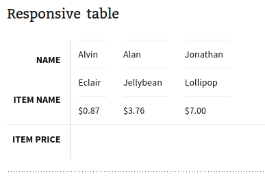

Videos
------

### Responsive Video&lt;&lt;Responsive Video&gt;&gt;

Available Attributes:
-   src: the link to the video
-   width: the width of the video in px (optional)
-   height: the height of the video in px (optional)
-   allowfullscreen: Allow the video to be made fullscreen (no value,
    just set inside the shortcode)
-   nocontrols: Remove play, pause, progress controls (no value, just
    set inside the shortcode)
-   frameborder: Width of the border around the video (recommended
    0, optional)

Example:

``` {.text}
[video src="//www.youtube.com/embed/Q8TXgCzxEnw?rel=0" width="500px" width="100%" allowfullscreen]
```

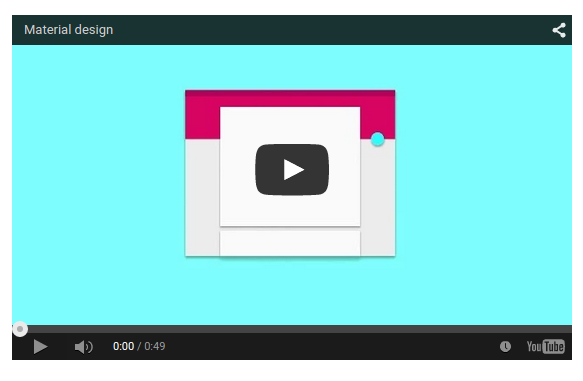

### HTML5 Video&lt;&lt;HTML5 Video&gt;&gt;

Available Attributes:
-   src: the link to the video
-   width: the width of the video in px (optional)
-   height: the height of the video in px (optional)
-   allowfullscreen: Allow the video to be made fullscreen (no value,
    just set inside the shortcode)
-   nocontrols: Remove play, pause, progress controls (no value, just
    set inside the shortcode)
-   frameborder: Width of the border around the video (recommended
    0, optional)

Example:

``` {.text}
[video src="//www.youtube.com/embed/Q8TXgCzxEnw?rel=0" width="500px" width="100%" allowfullscreen]
```

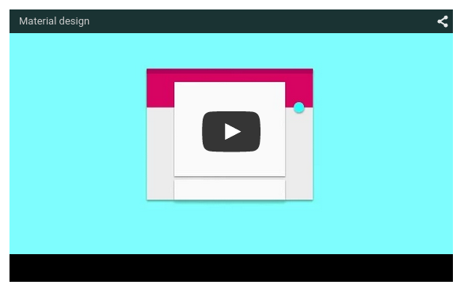
